# Práctica 1

Se solicita configurar y administrar los dispositivos de una infraestructura de red para una compañía siguiendo la siguiente topología de red

### Topología de red 

## Configuraciones para la topología de Red 
  A continuación se detalla cada uno de los comandos necesarios para realizar la configuración de cada uno de los dispositivos que conforman la topología de red 

### Router 
  Comando para acceder a la configuración de la terminal 
  - configure terminal 
  
  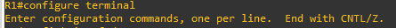
  
  Comando para acceder a la interfaz fastEthernet 0/0
  - int f0/0
  
   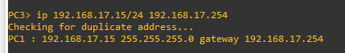
  
  Comando para configurar la ip del router 
  - ip address 192.168.13.254 255.255.255.0
  
   
  
  Comando para activar la interfaz
  - no shutdown
  
   
  
  Salir de la interfaz fastEthernet 0/0
  - Exit 
  
   
  
  Comando para acceder al fastEthernet 0/1
  - int f0/1
  
   
  
  Comando para configurar la ip del router 
  - ip address 192.168.17.254 255.255.255.0
  
   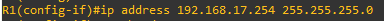
  
  Comando para activar la interfaz
  - no shutdown
  
   
  
  Salir de fastEthernet 0/1
  - Exit 
  
   
  
  Salir de las configuraciones
  - exit 
  
   
  
  Guardar los cambios 
  - wr 
  
   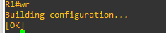
  
  Para mostrar la información de las interfaces
  - show ip interface brief
  
   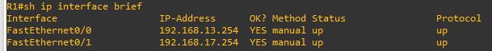
  

### VPC2
  Comando para configurar la ip 
  - ip 192.168.13.15/24 192.168.10.254
   
   
  
  Para mostrar la configuración de ip y máscara de red 
  - sh ip 
  
   
  
  Para guardar los cambios 
  - save 
  
   

### VPC3
 Comando para configurar la ip 
  - ip 192.168.17.15/24 192.168.10.254
  
  
  
  Para mostrar la configuración de ip y máscara de red 
  - sh ip
  
  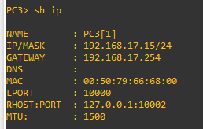
  
  Para guardar los cambios 
  - save

  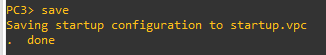

### VPC4
 Comando para configurar la ip 
  - ip 192.168.17.30/24 192.168.10.254
  
   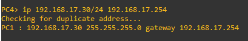
  
  Para mostrar la configuración de ip y máscara de red 
  - sh ip 
  
   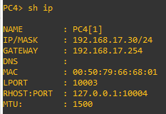
  
  Para guardar los cambios 
  - save
  
   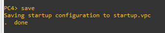

### linux-1
  Entrar al panel de control y seleccionar Network 
  
   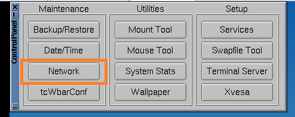
  
  Ingresar la siguiente ip, al darle enter los espacios se llenan automaticamente
    
   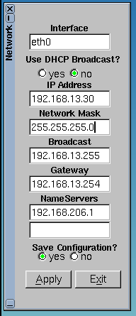
  
  Aplicar y Salir 

  Abrir la terminal 
   Comando para mostrar la configuración 
   - ifconfig 
   
   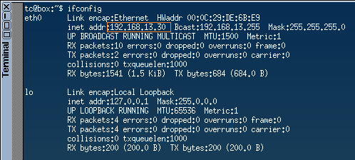
   
   
    

### Glosario

# 1. Ethernet
  Ethernet es un estándar de redes de área local creadas por la unión de varios ordenadores a través de cable.

# 2. FastEthernet
  Fast Ethernet es una Red de Área Local (LAN) de transmisión estandard y que proporciona una catidad de datos de 100 megabits por segundo(refiriendonos a  "100BASE-T").

# 3. GNS3
  GNS3 es un simulador gráfico de red lanzado en 2008, que te permite diseñar topologías de red complejas y poner en marcha simulaciones sobre ellos

# 4. IP
  Una dirección IP, es un protocolo de internet, que es una representación numérica que identifica una interfaz concreta de manera única en la red.

# 5. Máscara de Red 
   Una máscara de red es una combinación de bits que permite delimitar el ámbito de una red de ordenadores. De esta forma, la función de la máscara de red es indicar a todos        los dispositivos qué parte de la dirección IP es la correspondiente al número de la red, a la máscara de subred y la que corresponde al host.

# 6. Red 
  Dos o más computadoras o dispositivos periféricos, como impresoras, torres de CD-ROM, escáners y dispositivos semejantes, que están directamente conectados con el propósito de   compartir el hardware, el software y los recursos de información de los dispositivos conectados.

# 7. Router 
  Es un dispositivo que opera en capa tres de nivel de 3, permite que varias redes u ordenadores se conecten entre sí y compartan una misma conexión de Internet.
  
# 8. Switch
  Es un dispositivo que permite que la conexión de computadoras y periféricos a la red para que puedan comunicarse entre sí y con otras redes

# 9. Topología de red 
  Forma en que se conectan las computadoras para intercambiar datos entre sí
  
# 10. VPCs
  Son simuladores virtuales de PC 

